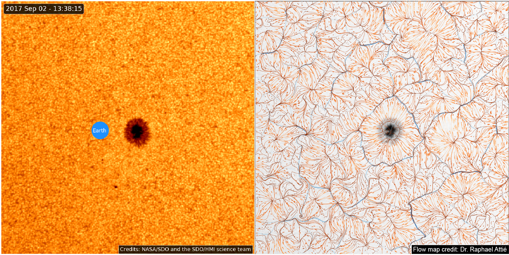

# README #

Python framework implementing the Balltracking ang Magnetic Balltracking algorithms for the data of the Helioseismic and Magnetic Imager (HMI) onboard the Solar Dynamics Observatory (SDO) 
These algorithms track plasma motions from intensity continuum image series (Balltracking) and series of magnetograms (Magnetic Balltracking).

### How do I get set up? ###

Following instructions are for linux and mac. 
I recommend using anaconda and conda virtual environments.
First install anaconda for Python 3.x: https://www.anaconda.com/download/
Using the provided requirements.txt file, you can install all packages at proper versions at once. 
You don't have to use virtual environment though to use the requirements file. It's just a way to keep this project isolated from your main Python installation (in case you have one already).

After installation, make sure you have the "conda" command working. E.g: (from terminal, try ``conda -V``)
Add conda-forge channel:

``conda config --append channels conda-forge``

Then create a new virtual environment, give it whatever name you want (here, i call it ``new_environment``), and using the *requirements.txt* file,
from a terminal, execute the following:

``conda create -n new_environment --file requirements.txt``

You also need to install the python package *fitsio* with:

``pip install fitsio``

Compile some binaries written in Cython:

- go to the *cython_modules* directory
- execute ``python setup_cbinterp.py build_ext --inplace``

For Balltracking only, not Magnetic Balltracking, you will need to run a calibration procedure.
After calibration, Balltracking runs through a script wrapping around the *balltrack_all()* function in *balltracking.balltrack*.

See examples (won't work as is, adapt to your data):

- Calibration: see *balltracking_test_scripts/test_calibration*
- To run Balltracking: *AR12673/script_balltrack_AR12673.py*
- To process flow maps upon balltracking results, see *script_velocity_lanes_AR12673.py*

### Who do I talk to for help? ###

Dr. Raphael Attie, contractor at NASA/Goddard Space Flight Center with George Mason University (https://science.gsfc.nasa.gov/sed/bio/raphael.attie)

